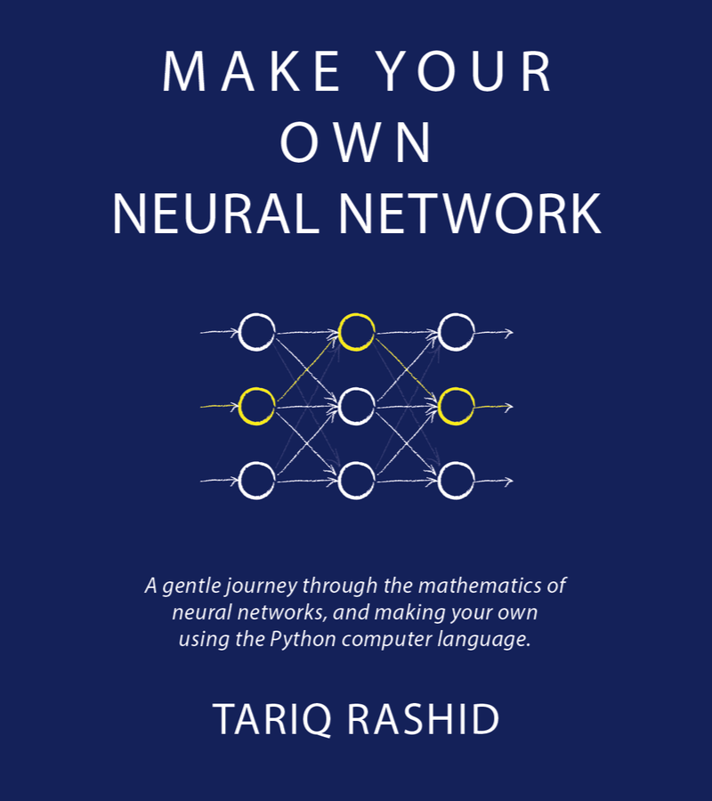

# Make Your Own Neural Network

This repository contains a from-scratch implementation of a simple neural network.

The design is inspired by Tariq Rashid’s book *Make Your Own Neural Network*, but it extends beyond the material covered there.

## Implementation

### Modules

The network is built using a few common layers/blocks:

* Linear (Weights)
* ReLU
* Sigmoid
* Softmax

Each layer supports both forward propagation and backpropagation (derivatives).

Here’s a diagram of the components:

### Weight Initialization

The linear layers can be initialized using different heuristics. Two popular ones are included:

* Normalized Xavier
* He

### Neural Network

All of these components are wrapped under a single class called **NeuralNetwork**.
It lets you choose:

* an activation function (ReLU or Sigmoid)
* a weight initialization method

The network architecture works as follows:

1. `len(hidden_layers)` fully connected linear blocks, each followed by an activation function
2. A final Softmax block

The class provides methods for both training (backward pass) and inference (forward pass).

## Experiments

The model was trained on the [MNIST dataset](https://en.wikipedia.org/wiki/MNIST_database) and reached **90%+** accuracy on the test set.

It was also tested on custom handwritten digits, where accuracy was noticeably lower:

This difference likely comes from variations between the custom images and the original dataset.

> [!INFO]
> More details can be found in the [`Demo` notebook](./Demo.ipynb).

## Further Work

The implemented model successfully learns patterns and produces solid results, even with a relatively simple dataset.

Some possible directions for further exploration include:

* Addressing vanishing and exploding gradients
  * Applying gradient clipping
  * Using gradient scaling
